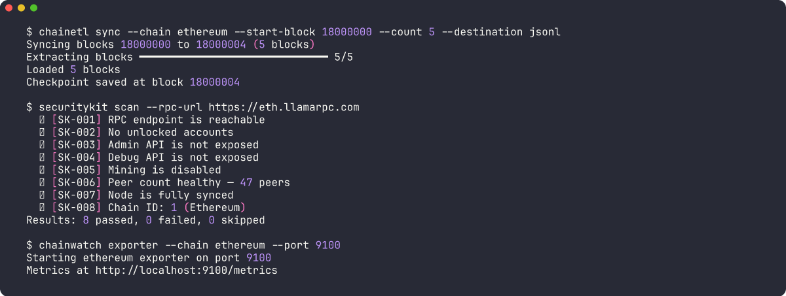

<div align="center">

# Celara

**DevOps tooling for decentralized systems.**

Deploy, monitor, analyze, secure, and govern blockchain infrastructure — from a single open-source toolkit.

[](LICENSE)
[](#)
[](https://python.org)
[](https://celara.dev)

[Website](https://celara.dev) · [Documentation](https://celara.dev/docs) · [API Reference](https://celara.dev/docs/api)

</div>

---



## The Stack

| | Product | What it does |
|---|---------|-------------|
| 🟣 | **[ChainETL](chainetl/)** | Extract blocks, transactions, logs, and token transfers from 4 EVM chains. Postgres + JSON Lines + REST API. |
| 🟡 | **[ChainOps](chainops/)** | Deploy validators with one command. Terraform templates for Ethereum + Solana on AWS. Cost estimation included. |
| 🔵 | **[ChainWatch](chainwatch/)** | Prometheus metrics exporter for EVM nodes. Grafana dashboard with 7 panels. Multi-chain monitoring. |
| 🔴 | **[SecurityKit](securitykit/)** | 8 RPC-based security checks. No SSH required. Markdown audit reports. CI/CD ready. |
| 🟢 | **[DAOForm](daoform/)** | Governance-as-Code. Proposals, weighted voting, quorum rules. YAML config + Python SDK. |

## Install

```bash
pip install chainetl chainops chainwatch securitykit daoform
```

## Quick Start

```bash
# Index Ethereum blocks to JSON files
chainetl sync --chain ethereum --start-block 18000000 --count 100 --destination jsonl

# Deploy a validator
chainops init ethereum --network mainnet && chainops estimate

# Monitor your node
chainwatch exporter --chain ethereum --port 9100

# Security audit
securitykit scan --rpc-url https://eth.llamarpc.com

# DAO governance
daoform init --name MyDAO && daoform validate

# REST API
chainetl serve --port 8000
# → http://localhost:8000/docs
```

## Why Celara

- **Open source** — Apache 2.0. Every tool, every line. Self-host everything.
- **Composable** — Each tool works standalone. Use one or all five.
- **Multi-chain** — Ethereum, Base, Polygon, Arbitrum. Adding a chain is a 3-line file.
- **Production-grade** — 136 tests. Type-safe Python. CI on every push.

## Documentation

Full docs at **[celara.dev/docs](https://celara.dev/docs)** — sidebar navigation, code examples, API reference.

Each product also has docs in its directory:

```
chainetl/docs/     → configuration, data models, API, adding chains
chainwatch/docs/   → metrics reference, alert rules, Grafana
chainops/docs/     → deployment guide, cost estimates
securitykit/docs/  → all 8 checks with remediation steps
daoform/docs/      → governance model, SDK, persistence
```

## Contributing

See [CONTRIBUTING.md](CONTRIBUTING.md). Fork, branch, test, PR.

## License

Apache 2.0 — See [LICENSE](LICENSE)

---

<div align="center">

Built by [Jarred](https://github.com/jtaylortech) & [Kofi](https://github.com/kofikwarba)

</div>
